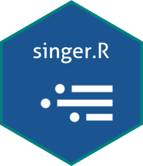

<!-- README.md is generated from README.Rmd. Please edit that file -->

# Singer for R 

<!-- badges: start -->

<!-- badges: end -->

R interface to the Singer open source data replication standard.
